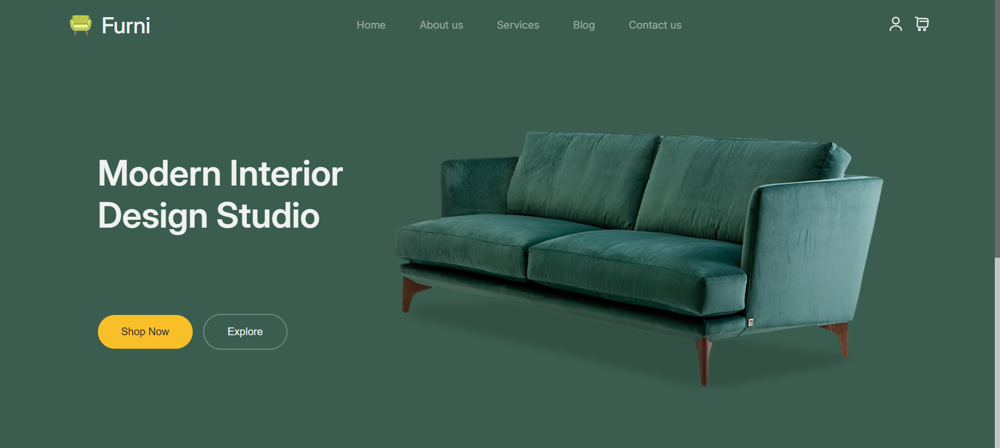

# Furni Shop

This repository showcases the front-end development of a minimalist and elegant e-commerce website for Furni Shop, a studio dedicated to crafting high-end, modern furniture, sophisticated seating, and exclusive designer toys.

Built purely with semantic HTML5 and meticulously styled CSS3, this project focuses on delivering a visually immersive and highly responsive user experience. It demonstrates a commitment to modern design principles, clean code, and aesthetic excellence, allowing the premium product line to take center stage.

## Demo

You can view a live demo of this project here: [Furni Shop](https://rozhnrnjbr-maker.github.io/Furni-Shop/)

## Screenshots

## Tech Stack

**HTML5:** For semantic content structure.

**CSS3:** For all styling, layout, responsiveness, and design elements.

## Author

- [@rozhnrnjbr](https://github.com/rozhnrnjbr)
